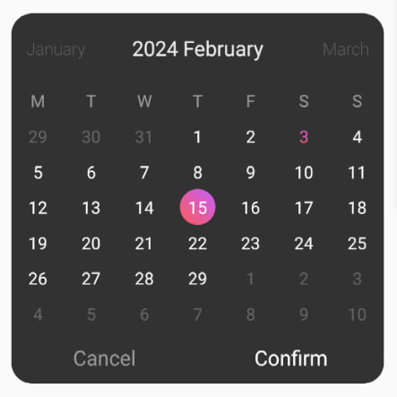
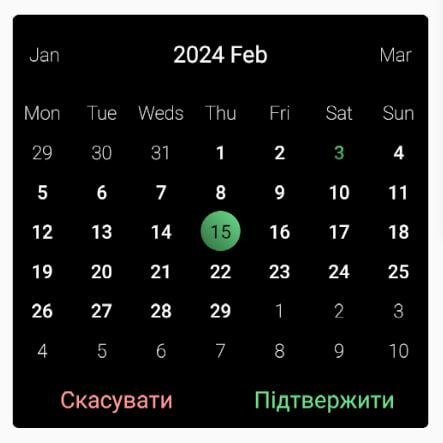

# Calendar Picker

Bare React Native calendar picker

### example of components with default properties



### Usage

```tsx
import Calendar from './CalendarPicker/Calendar';

<Calendar
  onSetDate={(value: any) => {
    console.log('set', value);
  }}
  onCancel={() => {
    console.log('Cancel');
  }}
  onConfirm={(value: any) => {
    console.log('onConfirm', value);
  }}
/>;
```

| Property            | Type               | Description                                                                                                                                                   |
| ------------------- | ------------------ | ------------------------------------------------------------------------------------------------------------------------------------------------------------- |
| containerStyles     | Object             | Styles that will be propagated to the container of the calendar                                                                                               |
| dateInMonthStyles   | Object             | Styles that will be propagated to the dates title which is in current month calendar                                                                          |
| dateOutOfMontStyles | Object             | Styles that will be propagated to the dates title which is previous or next current month calendar                                                            |
| dateInChosenStyles  | Object             | Styles that will be propagated to the date user choose                                                                                                        |
| weekDayStyles       | Object             | Styles that will be propagated to the week days titles                                                                                                        |
| currentMonthStyles  | Object             | Styles that will be propagated to the current month title                                                                                                     |
| otherMonthsStyles   | Object             | Styles that will be propagated to the previous or next month title                                                                                            |
| colors              | Array              | Colors that will appear to the chosen date as gradient apear                                                                                                  |
| returnValueType     | string             | Formate of date. Default is DD-MM-YYYY                                                                                                                        |
| weekDaysArr         | Array              | Array of week days title. Default is ['M', 'T', 'W', 'T', 'F', 'S', 'S']                                                                                      |
| monthsArr           | Array              | Array of months title. Default is ['January', 'February', 'March', 'April',' May', 'June', 'July', 'August', 'September', 'October', 'November', 'December',] |
| onSetDate           | function => string | Function after every time user choose date, returns date                                                                                                      |
| onCancel            | function => ()     | Function after cancel, return nothing                                                                                                                         |
| onConfirm           | function => string | Function after confirm, returns date                                                                                                                          |
| cancelButtonStyles  | Object             | Styles that will be propagated to the cancel button                                                                                                           |
| confirmButtonStyles | Object             | Styles that will be propagated to the confirm button                                                                                                          |
| cancelButtonTitle   | string             | Title that will be propagated to the cancel button                                                                                                            |
| confirmButtonTitle  | string             | Title that will be propagated to the confirm button                                                                                                           |

### example of using all properties



```tsx
import Calendar from './CalendarPicker/Calendar';

<Calendar
  containerStyles={{backgroundColor: '#000', borderRadius: 5}}
  currentMonthStyles={{color: '#FFF'}}
  otherMonthsStyles={{color: '#EEE'}}
  monthsArr={[
    'Jan',
    'Feb',
    'Mar',
    'Apr',
    'May',
    'June',
    'July',
    'Aug',
    'Sept',
    'Oct',
    'Nov',
    'Dec',
  ]}
  weekDayStyles={{fontWeight: '200', color: '#EEE'}}
  weekDaysArr={['Mon', 'Tue', 'Weds', 'Thu', 'Fri', 'Sat', 'Sun']}
  colors={['#2d6e3e', '#6fde8d']}
  dateInMonthStyles={{fontWeight: '500', color: '#FFFFFF'}}
  dateOutOfMontStyles={{fontWeight: '200', color: '#FFFFFF'}}
  dateInChosenStyles={{color: '#000000'}}
  returnValueType="MM/DD/YYYY"
  onSetDate={(value: any) => {
    console.log('set', value);
  }}
  onCancel={() => {
    console.log('Cancel');
  }}
  onConfirm={(value: any) => {
    console.log('onConfirm', value);
  }}
  cancelButtonStyles={{color: '#FF9999'}}
  confirmButtonStyles={{color: '#6fde8d'}}
  cancelButtonTitle="Скасувати"
  confirmButtonTitle="Підтвердити"
/>;
```
